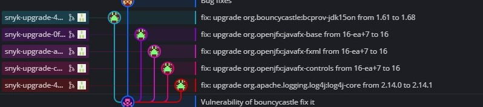
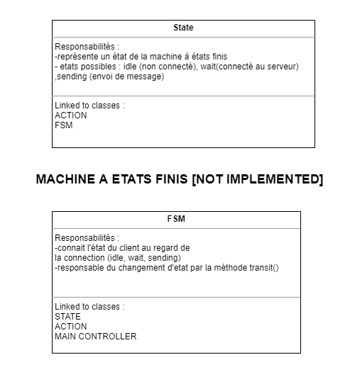
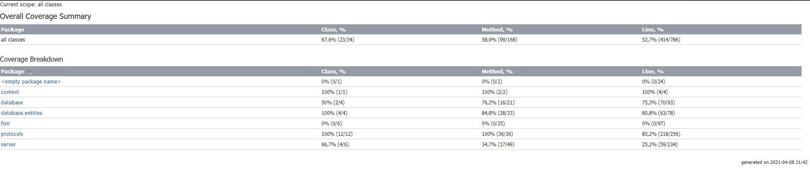
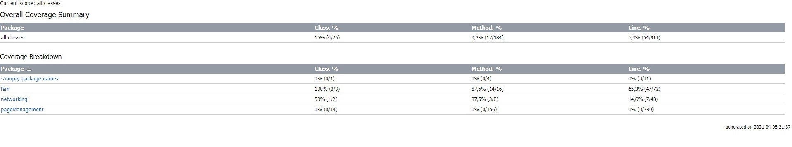

# Projet-Conception-Logicielle

## Introduction 
Ce projet consiste en la création d'un service de messagerie distribuée à l'instar de Teams ou discord. Il s'articulera autour d'un client et d'un serveur.
Le serveur est en charge de la distribution des groupes, messages et responsable de l'authentification des utilisateurs. 
Le client permet lui à un utilisateur l'envoi de requètes via une IHM, lui permettant de communiquer avec les autres utilisateurs. 

Membre du projet : Alexandre Froehlich, Guillaume Leinen, Jean-Noël Clink, Erwan Aubry, Ayrwan Guillermo

Serveur : Alexandre, Erwan 

Client : Guillaume, Jean-Noël, Ayrwan

## fonctionnalités et patterns implémentés

### Fonctionnalités 
Le serveur est capable de : 

* Importer les données d'une base de donnée dans le serveur. 
* Répondre à une requête du client (format JSON) avec une fonctionnalité d'exclusion mutuelle implémenté par une machine à états finis : en bloquant le serveur sur un état défini, on empêche la création de requêtes en doublon et on évite la saturation du serveur (SPAM ou DDOS). 
* [à Compléter]

Le client peut quand à lui :
- permettre à l'utilisateur de **s'authentifier** par un login et mdp
- accéder aux discussions auquel l'utilisateur est inscrit
- créer une nouvelle discussion ainsi que de modifier les paramètres d'une discussion
- retrouver les messages précédemment envoyés par soi-meme ou d'autres utilisateurs

De manière commune, un **logger** permet un retour d'information clair dans le terminal exécution pour chaque application. 

Il est important de noter que la **sécurité** à été un point d'intérêt particulier au cours de ce projet. Ainsi, les mots de passes sont **hachés** et ne transite pas en clair par le réseau, et l'identifiant est lui transité par une **chaine de caractère aléatoire** créé lors de la création d'un profil. Aussi le programme est analysé par un bot hébergé sur GitHub qui renseigne sur les failles : SNYK 



Ici le bot à corrigé les vulnérabilités liés à des bibliothèques non définitives ou pas à jour. 

Enfin, les profils, groupes de discussions et messages sont tous stockés sur une **base de donnée SQLite**. 

### Patterns 
Pour ce projet nous avons utilisé un certains nombre de patterns de programmations : 
<<<<<<< HEAD
- serveur TCP concurrent : implémenté au niveau du serveur. Permettant de créer le serveur en lui même et écouter la connection de divers clients.
- motif sujet-observateur et délégation : ce motif est implémenté au niveau du client. L'envoi de message n'est pas supervisé par le controlleur de discussion mais par une classe observateur. Le Controlleur est un observable et un clic sur le bouton "ENTRER" va enclencher une notification envoyé via l'API Java à l'oservateur "MessageSender". C'est lui qui se charge de l'envoi de message. On a donc à la fois une classe observatrice qui interagit pas avec l'élément observé, et une classe qui permet une délégation d'une fonctionnalité.  
- motif stratégie : implémenté au niveau du serveur. Permettant de classer et faciliter le développement des différents protocoles présents, afin que l'utilisateur client puisse interagir avec le serveur.
- motif composant-composite : implémenté au niveau du serveur. Permet de créer une machine à état fini afini de gérer le fait que le serveur accepte la connection, envoie des messages, reçois des messages et ferme la connection.
=======
- serveur TCP concurrent : implémenté au niveau du serveur [ a compléter ]
- motif sujet-observateur et délégation : ce motif est implémenté au niveau du client. L'envoi de message n'est pas supervisé par le contrôleur de discussion mais par une classe observateur. Le Contrôleur est un observable et un clic sur le bouton "ENTRER" va enclencher une notification envoyé via l'API Java à observateur "MessageSender". C'est lui qui se charge de l'envoi de message. On a donc à la fois une classe observatrice qui interagit pas avec l'élément observé, et une classe qui permet une délégation d'une fonctionnalité.  
- motif stratégie : implémenté au niveau du serveur [ a compléter ]
- motif composant-composite : implémenté au niveau du serveur [ a compléter ]
>>>>>>> 9c664b9f5244808300e6099ad87c1f47ccb0d2f6

 ### Conception : Cartes CRC 

Nous nous sommes servis de fiches CRC que nous avons complété au fur et à mesure des implémentations du projet. 

Ces cartes permettent de représenter les interactions entre les classes, voici un exemple : 



L'ensemble des cartes CRC est consultable dans `docs/CRC` 

### Conception : Tests unitaires 

Nous avons testé un certains nombre de fonctionnalités qui étaient à notre portée et clés pour le fonctionnement du projet. Nous nous sommes donc concentré sur les tests du serveur, vu que le client est essentiellement une IHM et qu'il est difficile de tester des fonctionnalités @fxml (en tout cas avec JUnit). 

Vous pouvez retrouver les tests dans le dossier "test" de chaque projet respectif. 

Voici les coverages relatifs à ces tests : 

Serveur : 



Client : 



### Conception: suivi Agile 

Le suivi de projet, en mode Agile, a été effectué par l'utilitaire Zenhub. 

## Utilisation

génération d'un Jar : 

```bash
mvn install 
```

Pour le lancement de l'application 

```shell
java -jar target/serveur-conception-logicielle-1.0-SNAPSHOT-jar-with-dependencies.jar
```

## Développement futur

Nous avons implémenté une Machine à Etats Finis (FSM) sur le serveur pour le proteger contre le doublement de l'information ou le spam de requête. 

La machine dispose de 4 états : **idle, sending, receiving, closing** 

Nous avons ajouter sur le client une FSM à 3 etats : **idle, waiting, sending.** 

Cependant nous n'avons pas encore implémenté la fsm dans le client. Toutefois les classes existent et sont testés donc il reste juste l'implémentation. 

Il aurait été aussi souhaitable de **hashé** les messages, mais nous sommes limités en caractères pour un message et un hash en augmente trop la taille. 


