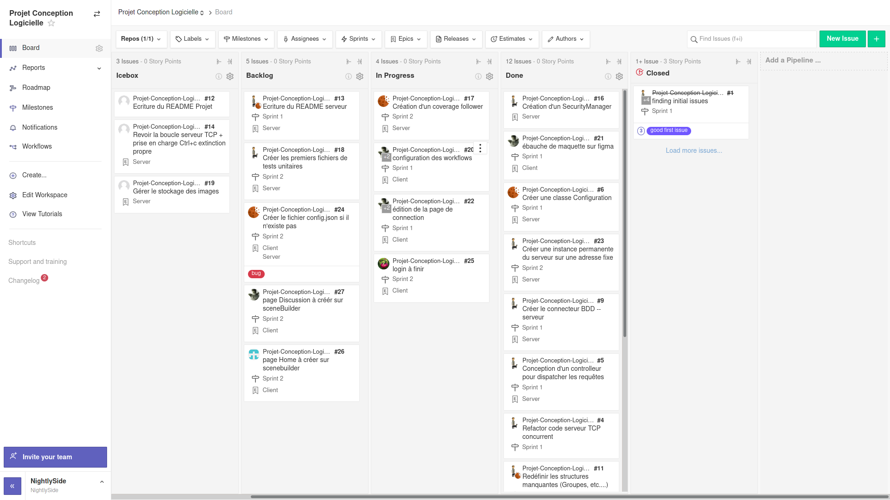
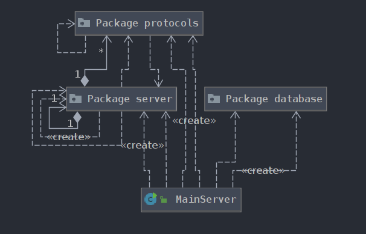
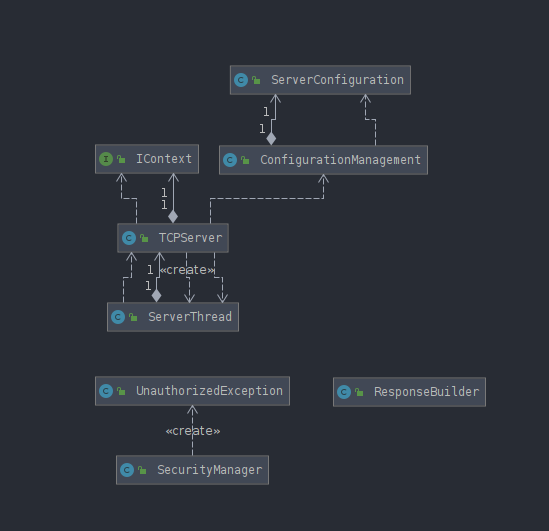
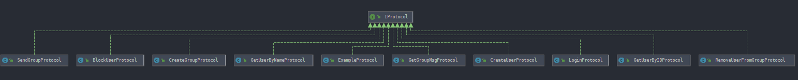
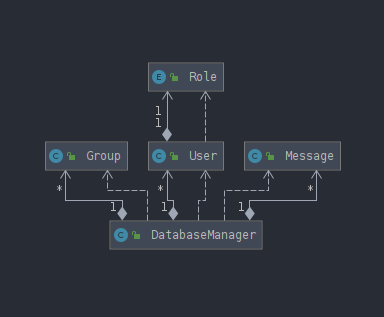
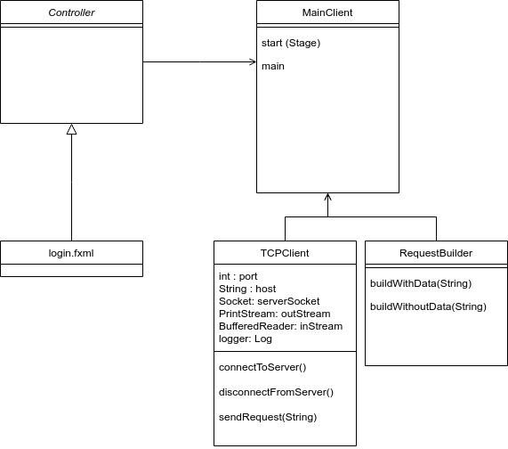

# 26 février 2021

>   **Backend :**
>
>   Alexandre FROEHLICH
>   Erwan AUBRY
>
>   **Frontend :**
>
>   Guillaume LEINEN
>   Ayrwan GUILLERMO
>   Jean Noël CLINK

## User stories

*   Création d'un SecurityManager
*   Création d'une classe Configuration
*   Création d'une instance permanente de serveur sur une carte RPi dédiée
*   Création d'une BDD Sqlite
*   Implémentation d'un ORM : ORMLite
*   Création d'un controlleur pour dispatcher les requêtes
*   Refactorisation code serveur TCP concurrent
*   Définition des structures manquantes (Groupes, Users, …)
*   Changement des requêtes texte en requêtes JSON et réponses en JSON
*   Création des entities (modèles) des entrées BDD
*   Créer une classe protocole par commande
*   Ébauche de maquette inerte sur FIGMA de l'application client
*   Commencement de la page de login client

Pour rappel l'ensemble des user stories est disponible sur le Zenhub : https://app.zenhub.com/workspaces/projet-conception-logicielle-602f6ef86e99540010214bae/ ou encore dans les issues du repository github : https://github.com/Projet-Java-ENSTA-Bretagne/Projet-Conception-Logicielle/issues



## Résultats des tests unitaires

Pour l'instant nous n'effectuons pas de tests unitaires. Cette séance étant essentiellement dédiée à l'installation des logiciels et des dépendances.

Nous sommes déjà en train de mettre en place un coverage automatisé du code : https://github.com/Projet-Java-ENSTA-Bretagne/Projet-Conception-Logicielle/issues/17

## Cartes CRC

## Exécutables

Les fichiers exécutables se trouvent dans l'archive en pièce jointe. On fait bien la distinction client/serveur :

*   Client : client-conception-logicielle-1.0-SNAPSHOT-jar-with-dependencies.jar
*   Serveur : serveur-conception-logicielle-1.0-SNAPSHOT-jar-with-dependencies.jar

## Documentation

La documentation n'a pas été écrite pour ce premier sprint. Pour les prochains elle se fera générer par javadoc.

### Client

**Maquette inerte sur FIGMA**  

Le but de cette maquette est de visualiser l'apparence souhaité du client sans avoir à  rédiger de code.  

**Charte Graphique**  

Nous partons sur une charte graphique Material design pour des raisons esthétiques principalement  

**Implémentation dans un projet javafx**  

Pour ajouter des composants Material-design dans Javafx, nous utilisons la bibliotèque Jfoenix. Elle s'intègre comme une dépendance Maven : 

```
<dependency>
    <groupId>com.jfoenix</groupId>
    <artifactId>jfoenix</artifactId>
    <version>9.0.10</version>
</dependency>
```

L'ajout dans Scenebuilder s'effectue via lé téléchargement d'un Jar de Jfoenix et son import dans scenebuilder.

## Diagrammes de classe

### Serveur










### Client

