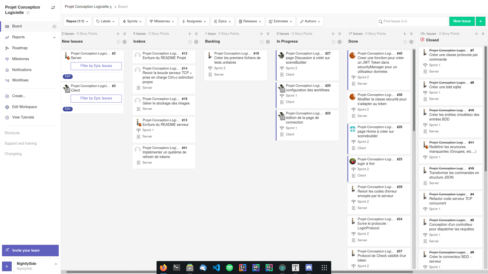

# 19 mars 2021

>   **Backend :**
>
>   Alexandre FROEHLICH
>   Erwan AUBRY
>
>   **Frontend :**
>
>   Guillaume LEINEN
>   Ayrwan GUILLERMO
>   Jean Noël CLINK

## User stories

*   Écriture des protocoles suivants : GetGroupMsgProtocol, GetUserByNameProtocol, GetUserByIdProtocol, CreateUserProtocol, CreateGroupProtocol, BlockUserProtocol, RemoveUserFromGroup, SendGroupProtocol, LoginProtocol
*   Écriture d'un protocole qui vérifie si un token est valide
*   Création d'un coverage follower
*   Possibilité de recréer le fichier config.json s'il n'existe pas
*   Revoir les codes d'erreur envoyés par le serveur
*   Modifier la classe sécurité pour s'adapter au token
*   Créer une fonction pour créer un JWT token dans securityManager pour un utilisateur de données
*   Refactorisation du projet client
*   Ajout de documentation à toute la partie client
*   Réalisation des pages Login et Home
*   Commencement de la page de discussions

Pour rappel, l'ensemble des user stories est disponible sur le Zenhub : https://app.zenhub.com/workspaces/projet-conception-logicielle-602f6ef86e99540010214bae/ ou encore dans les issues du repository github : https://github.com/Projet-Java-ENSTA-Bretagne/Projet-Conception-Logicielle/issues

## Résultats des tests unitaires

Pour la partie serveur, des tests unitaires ont été implémentés depuis le sprint 1. Voici un aperçu du coverage actuel de ceux-ci :

Pour l'instant, la partie client ne contient pas de tests unitaires (mais cela ne saurait tarder).

## Exécutables

Les fichiers exécutables se trouvent dans l'archive en pièce jointe. **On fait bien la distinction client/serveur** :

*   Client : client-conception-logicielle-2.0-SNAPSHOT-jar-with-dependencies.jar
*   Serveur : serveur-conception-logicielle-2.0-SNAPSHOT-jar-with-dependencies.jar

## Documentation

Pour ce deuxième sprint, la documentation a été écrite, que ce soit pour la partie client ou bien pour la partie serveur. Celle-ci est générée via javadoc.

### Configuration de la partie client

En ce qui concerne la partie client, nous avons réalisé une vidéo YouTube pour vous accompagner en détail dans la mise en place du client. Le lien vers cette vidéo est le suivant : https://youtu.be/itsy6GBx_7g

