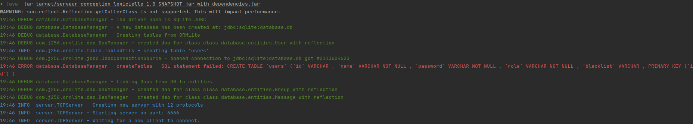

# Partie serveur
> Équipe :
> - Alexandre FROEHLICH
> - Erwan AUBRY

[](https://codecov.io/gh/Projet-Java-ENSTA-Bretagne/Projet-Conception-Logicielle)
[](https://codeclimate.com/github/Projet-Java-ENSTA-Bretagne/Projet-Conception-Logicielle/maintainability)

## Introduction

Le projet java proposé par Joël CHAMPEAU, a été divisé en deux parties, une partie serveur et une partie client. Ici nous allons parlé de la partie serveur.

Si vous souhaité visualiser la documentation du projet suivez ce lien : [design-document.md](https://github.com/Projet-Java-ENSTA-Bretagne/Projet-Conception-Logicielle/blob/main/docs/design-document.md)

## Requirement

- JAVA 8
- Maven

## Installation et compilation

Pour la génération du .jar :
```shell
mvn install
```

Pour le lancement de l'application :
```shell
java -jar target/serveur-conception-logicielle-1.0-SNAPSHOT-jar-with-dependencies.jar
```

Vous verrez donc : 



